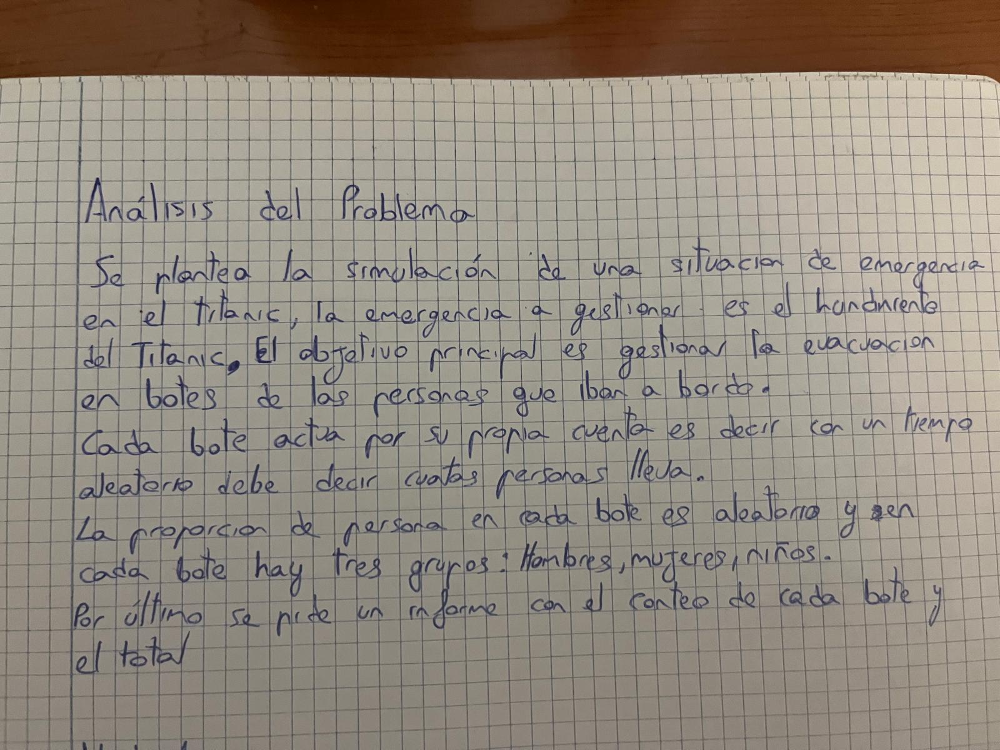
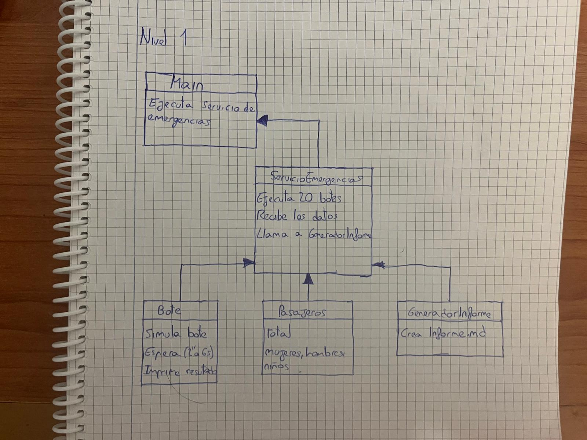
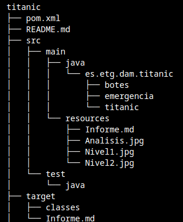

# TITANIC

## Hecho por **Anas Oulghazi**

---

## Índice

- [TITANIC](#titanic)
  - [Hecho por **Anas Oulghazi**](#hecho-por-anas-oulghazi)
  - [Índice](#índice)
  - [Analisis del problema](#analisis-del-problema)
  - [Diseño de solucion](#diseño-de-solucion)
  - [Manual de usuario](#manual-de-usuario)
  - [Elementos destacables del desarrollo](#elementos-destacables-del-desarrollo)
  - [Problemas encontrados](#problemas-encontrados)
  - [Conclusiones individuales](#conclusiones-individuales)
  - [Ruta Git](#ruta-git)

---
## Analisis del problema

## Diseño de solucion

## Manual de usuario

Para ejecutar desde la consola de comandos se debe ingresar este comando entero
"java -cp target/classes es.etg.dam.titanic.titanic.Main"

Otra opcion es dede vcode darle al boton de play y eejecutar el main

Una vez ejcutado tardará en mostrar el resutado entre 2 a 3 minutos y que se estara ejecutando

El archivo se mostrara en la carpeta resouces y tendra el nombre Informe.md

Estructura del proyecto:

## Elementos destacables del desarrollo

- **Uso de Runtime**
  Se ha utilizado `Runtime.getRuntime().exec(...)` para ejecutar cada bote como un proceso independiente. Esto permite simular que cada bote funciona por separado, como si fueran pequeñas aplicaciones que trabajan al mismo tiempo

- **Lectura con BufferedReader**
  Para recoger los datos que imprime cada bote por consola, se ha usado `BufferedReader` junto con `InputStreamReader`, e utiliza para leer la información generada por cada proceso y convertirla en datos para el informe

- **Generación de informe en formato Markdown**
  El informe final se guarda como archivo `.md`

- **Separación por clases**
  El proyecto está dividido en varias clases: una para simular los botes, otra para grstionar la emergencia, otra para generar el informe, y una más para representar los pasajeros. Esto ayuda a que el código sea más fácil de entender y mantener

- **Uso de Lombok**
  Para simplificar la clase `Pasajeros`, he uitlizado Lombok con  `@Data` y `@AllArgsConstructor`. Esto evita tener que escribir manualmente los métodos `get`, `set` y el constructor

## Problemas encontrados

- **Ejecución de botes en ServicioEmergencias**  
  Tuve un problema que me costó bastante resolver. Al ejecutar los procesos con `Runtime.getRuntime().exec(...)`, el comando no me devolvía la información de los botes. Esto provocaba que algunos datos no llegaran al informe final. Después de revisar el código y probar diferentes formas de leer la salida del proceso, conseguí solucionarlo

- **Test**
  He intentado hacer test pero no sé qué pasaba, que no me permitía debuggear. No me aparecía la opción y lo tenía todo bien, ya que tenía las dependencias puestas y todo estaba bien importado, pero no me aparecía el botón de play. No conseguí solucionarlo

- **Hacer la arquitectura**  
  Ya que no cuento con mucha experiencia haciendo la arquitectura, me costó bastante hacerlo. No llego a ver bien los diferentes niveles que hay

## Conclusiones individuales

Direa que ha sido el proyecto mas dificil que he hecho nunca en cuanto como al diseño como a la parte programndo. Ha habido cosas nuevs que he aprendido como lo del `Thread.sleep(2000);` o `DateTimeFormatter`

## Ruta Git

https://github.com/anasoulgha/titanic
